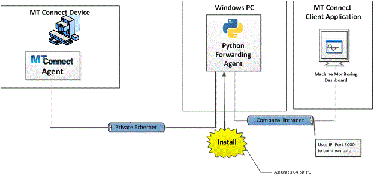
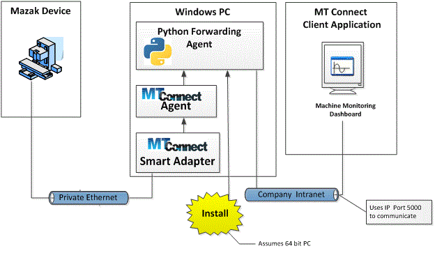
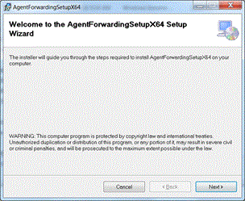
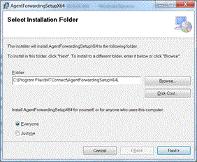
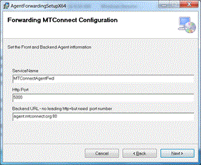
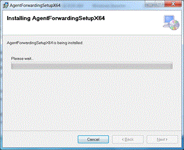
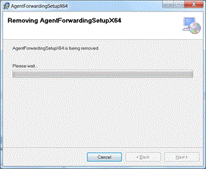
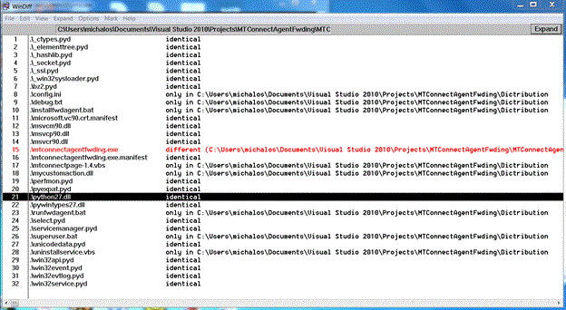
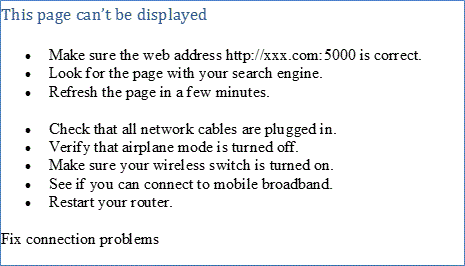

# README
 
----

Monday, November 19, 2018
This document presents a brief background on the mechanics of the MTConnect forwarding agent.  This document assumes the reader is familiar with MTConnect operation, and for deeper explanation of MTConnect, please refer to MTConnect URL: http://www.mtconnect.org/ for more information. This document concerns itself with an implementation of a MTConnect Agent XML reader and an embedded web server that only supports "current" MTConnect data queries. Thus, a forwarding agent will read the current status from another MTConnect agent, and serve this XML MTConnect data to the querying client. In addition, the ability to rename tags or details or enums is possible with the python program. Note, if you just forwarding the MTConnect XML you could just use port forwarding, however, this program makes adjustments to the MTConnect XML before forwarding.
# Background 
MTConnect is a new standard developed to facilitate the exchange of data on the manufacturing floor. The MTConnect open specification provides for cost effective data acquisition on the manufacturing floor for machine tools and related devices.  MTConnect is based upon prevalent Web technology including XML and HTTP.   Figure 1 shows the MT Connect architecture. An "MTConnect Device" is a piece of equipment – in this case a ABB robot machine tool, which (optionally) includes an MTConnect Adapter so that we can get data from it. The "Agent" is a process that acts as a "bridge" between a device and a factory "Client Application".  To learn more about MTConnect visit: http://www.mtconnect.org/ 
Figure 1 shows a typical MTConnect forwarding Agent system architecture (note at this time you can only forward one MTConnect XML data at a time). 

The forwarding Agent can also read a local Agent on the same PC and translate and/or interpret the XMl and at the same time provide a Web Service for reading by a remote client. Mazak offers a "Smart" Adapter that can remotely read the status of the CNC and present the data as an Adapter on the local port 7878. The open source MTConnect Agent can read this data and provide a Web Service for clients to read the Mazak XML data. The forwarding Agent acts as a client, and reads the MTConnect Agent, translates some of the tags into another name (configurable) and then another client can remote access this web server to retrieve the Mazak data as a "current" fetch. 

The forwarding agent is writtenin Python so it is simple and can easily be customized to change tag name, enumeration value or provide simple logic, such as interpreting 3 spindle operation into a single MTConnect srpm data tag.
This document describes the data gathering from a MTConnect Agent that is served a XML data in another web server. 
# Installation
There is an MSI to install and uninstall the MTConnect forwarding agent. Often the install file is exchanged by email with the "msi" extension changed to "msx", and you need to change this back.
Then double click the msi script:

Welcome for next.

See configuration for more details.

## Removal
You can run the msi script to remove the application and folder, but you will have to manually stop and remove the Service BEFOREHAND.
 1. Change directory to the installation folder
 2. Run the uninstallService.vbs as administrator
 3. Make sure the input name matches the service name: e.g., MTConnectAgentForwarding
The install wizard also removes. Double click the msi script and then select uninstall:

Wait for the UAC administrator rights…

All done – now remove the service. Check It may be removed.

# Configuration
In the Config.ini file, you can change the ServiceName, Agent port and query times of the log files. These changes will take if you stop/restart the Agent service or reboot the machine.

	[MTCONNECT]
	servicename=MTConnectAgentFwd
	fwdport=5010
	backurl=agent.mtconnect.org:80
	refresh=5
	
	[TAGS]
	mode=controllermode
	Fovr=path_feedrateovr
	Fact=path_feedratefrt
				
	[ENUMS]
	READY=IDLE
	ACTIVE=EXECUTING
	INTERRUPTED=PAUSED
	STOPPED=PAUSED
	
	[DATAIDS]
	Fovr=path_feedrateovr
	Frt=path_feedratefrt
	
There are four sections to the ini file: TAGS, ENUMS, DATAIDS and MTCONNECT.  Section names are enclosed in braces (i.e., "[]"). The MTCONNECT section options for 
 - new service web service name (i.e., servicename), 
 - agent forward web server port: (i.e., fwdport)
 - back end url that the forwarding agent will read to refresh the MTConnect data (i.e., backurl). Note the URL also contains a port number (after the colon).
 - refresh rate that the forward agent updates the MTConnect data (i.e., refresh) that is expressed in seconds.
The TAGS section handles the renaming of MTConnect "name" fields.  The replacement is not very robust, but is sufficient. For example, the action to replace name attribute "mode" with "controllermode" in the MTConnect XML below:

	<ControllerMode dataItemId="cn3" timestamp="2016-11-08T14:05:44.717920" name="mode" sequence="241775339">AUTOMATIC</ControllerMode>
Is achieved with the following Config.ini entry into the TAGS section:

	[TAGS]
	mode=controllermode
Likewise substituting identifiers for dataId attributes in the MTConnect XML as seen in:

	<PathFeedrate dataItemId="Fovr" timestamp="2016-11-08T14:05:44.717920" sequence="241775341">100.0000000000</PathFeedrate>
is achieved with the following Config.ini entry into the DATAIDS section:

	[DATAIDS]
	Fovr=path_feedrateovr
Finally, enumerations can be replaced with different text entries. The MTConnect execution data item has a set of enumeration that can be remapped. For example, the MTConnect XML for the execution data item is shown below:

	<Execution dataItemId="cn6" timestamp="2016-11-08T14:09:09.577173" name="execution" sequence="241830877">ACTIVE</Execution>
And changing the ACTIVE value is achieved with the following Config.ini entry into the ENUMS section:

	[ENUMS]
	ACTIVE=EXECUTING
Note as of this version all ACTIVE text entries in the XML will be changed to EXECUTING.
# Source Code 
The forwarding agent is written in Python and was debugged using Visual Studio 10 (that supports a Python add in). 
Pyinstaller was used to create an executable from the Python script to forward code. Embedded in the code is the ability for the application to also serve as a Windows Service. In order to achieve, these windows specific functionality the Python package "Pywin32".
## Pyinstaller
PyInstaller is a program that bundles a Python program into stand-alone executables, under Windows, Linux, Mac OS X, FreeBSD, Solaris and AIX. PyInstaller works with Python 2.7 and 3.3—3.5. Python 2.7 was used to code the forward agent.
To install Pyinstaller on Windows 7 (assuming python is installed!) merely open a DOS command shell and type:

	C:\Users\michalos>pip install pyinstaller

Then you can bundle the python program into a standalone executable with all the necessary Python packages included. Read https://pyinstaller.readthedocs.io/en/stable/operating-mode.html for more information. 
To bundle the Python forwarding agent, you need to open a Windows Shell with Command Prompt (naviaget through windows explorer file manager to the project folder, then right click in MTConnectAgentFwding folder and select open command prompt) and run Pyinstaller as in the snippet below:

	C:\Users\michalos\Documents\Visual Studio 2010\Projects\MTConnectAgentFwding\MTC
	onnectAgentFwding>pyinstaller MTConnectAgentFwding.py

Pyinstaller will create two folders "build" and "dist", of which "dist" will contain the executable and all the dependent Python and C++ compiled code and libraries.
Using windiff to compare  the ./Distribution with the pyinstaller /dist is usefull to insure when redistributing the exe only.


## Pywin32

Pywin32 is Python for Windows Extensions 

Note, from the limited documentation on pywin32: _Some packages have a 32bit and a 64bit version available - you must download the one which corresponds to the Python you have installed.  Even if you have a 64bit computer, if you installed a 32bit version of Python you must install the 32bit version of pywin3_ . Since the development was done on a 64 bit Windows 7 box, the 

If you choose the wrong pywin32 installation package (speaking from experience here) you will get 

	ImportError: No module named win32service 

Again, navigate to http://sourceforge.net/projects/pywin32/ and select the latest download for your System and your Python version.  For me the download version that worked was:  Navigate to https://sourceforge.net/projects/pywin32/files/pywin32/Build%20220/  and then I selected the download option "pywin32-220.win-amd64-py2.7.exe" since I was running Python 2.7 on a 64-bit platform.
One significant problem ensued from using pywin32:

	Pyinstaller - ImportError: No system module 'pywintypes' (pywintypes27.dll)

Perusing the Internet, I found this advice that actually worked: (From http://stackoverflow.com/questions/18907889/importerror-no-module-named-pywintypes )

	pip install pypiwin32

Then pyinstaller worked again. Amazing.
Using pywin32 to program the forward agent as a service: (Advice from: http://stackoverflow.com/questions/32404/is-it-possible-to-run-a-python-script-as-a-service-in-windows-if-possible-how)
These are the pywin32 packages that must be imported into the Python program:

	import win32serviceutil
	import win32service
	import win32event
	import servicemanager
	import socket

Then a simple service overload was used to integrate with the Windows service manager.

	class Service (win32serviceutil.ServiceFramework):
	    global SERVICENAME
	    _svc_name_ = SERVICENAME
	    _svc_display_name_ = SERVICENAME
	    _svc_description_ = "Echo MTConnect XML stream with modifications"
	    def __init__(self,args):
	        dfile.write( time.asctime()+ "Server enter __init__ \n" )
	        win32serviceutil.ServiceFramework.__init__(self,args)
	        self.hWaitStop = win32event.CreateEvent(None,0,0,None)
	        
	        socket.setdefaulttimeout(60)
	        # This is how long the service will wait to run / refresh itself (see script below)
	        self.timeout = 30000     #30 seconds
	        self.stop_event = win32event.CreateEvent(None, 0, 0, None)
	
	    def log(self, msg):
	        #import servicemanager
	        #servicemanager.LogInfoMsg(str(msg))
	        dfile.write(time.asctime() + msg + "\n")
	    def sleep(self, sec):
	        win32api.Sleep(sec*1000, True)
	    def SvcStop(self):
	        self.ReportServiceStatus(win32service.SERVICE_STOP_PENDING)
	        self.stop()
	        win32event.SetEvent(self.stop_event)
	        self.ReportServiceStatus(win32service.SERVICE_STOPPED)
	
	    def SvcDoRun(self):
	        self.ReportServiceStatus(win32service.SERVICE_START_PENDING)
	        try:
	            self.ReportServiceStatus(win32service.SERVICE_RUNNING)
	            self.start()
	            win32event.WaitForSingleObject(self.stop_event, win32event.INFINITE)
	        except Exception, x:
	            self.log('Exception : %s' % x)
	            self.SvcStop()
	    def start(self):
	        MyMain()
	        self.runflag=True
	        while self.runflag:
	            self.sleep(10)
	    def stop(self):
	        global bflag
	        self.runflag=False
	        bflag=False
There is event logging but most was removed as the possibility of overflowing the event log with meaningless and hard to get to error messages was deemed imprudent. A note of caution, don't change

	      socket.setdefaulttimeout(60)
to 0, or you will get socket timeout error. They appeared mysterious at first, but not upon reflection.
To be a service to be installed or a service to be started or an application required the main routine to handle all three cases. Numerous attempts did not work. Pywin32 will do straight python into a service with the install command, and will handle the service start directly. However, it was preferred to bundle the python and not make users install python when they are only using an executable. So pyinstaller would have to treat the exe as a service which is different than a normal application and was not intuitive. Fortunately, someone on the internet figured is out and posted the answer:  http://stackoverflow.com/questions/25770873/python-windows-service-pyinstaller-executables-error-1053/25934756#25934756  under the section of "Try changing the last few lines to" without which I would still be cursing. I added the ability to run the exe as a regular application.

	if __name__ == '__main__':
	    if len(sys.argv) == 1:
	        servicemanager.Initialize()
	        servicemanager.PrepareToHostSingle(Service)
	        servicemanager.StartServiceCtrlDispatcher()
	    elif len(sys.argv) > 1  and (sys.argv[1:2][0] == 'debug' or sys.argv[1:2][0] == 'run'):
	        MyMain()
	    else:
	        win32serviceutil.HandleCommandLine(Service)

# Troubleshooting
This section covers problems that have been encountered using the forwarding agent. 
The easiest way to test the forwarding agent is to start a web browser on the host machine and enter the URL: http://127.0.0.1:5000/current and see if any MTConnect XML data appears. (This assumes the port 5000 matches the port entered either by the msi install script or by manually configuring the Config.ini file. Start with the local host (127.0.0.1) since the firewall is not involved. Make sure the connection works and the MTConnect data is being refreshed. 
After this has web connection to the local URL has been established, you can then try a remote web connection. You will need the ip of the PC that is hosting the forwarding agent. Just replace the 127.0.01 with the PC ip address. If this fails, you probably have a firewall blocking the access to the port, see section on Firewall issues.
## This page can't be displayed
You will attempt to read data from the forwarding agent and you will get a page can't be displayed with a number of potential issues:

_Figure 1 Connection Problem_

This is due to the forwarding agent ONLY handling "/current" requests: i.e., http://ipaddress:xxx/current.
## Firewall Issues
The windows firewall or other firewall can block access to this and any other MTConnect agent URL with a port. So you should check if a firewall is blocking port 5000.  If the Windows firewall is turned off, this shouldn't block access through the port to the forwarding agent. Unfortunately, there can be a hardware or other firewall installed which can block the access.  Whenever possible, turn them off and try to connect. If you can connect, open the port and then restart the firewall.
See URL: https://support.microsoft.com/en-us/instantanswers/c9955ad9-1239-4cb2-988c-982f851617ed/turn-windows-firewall-on-or-off for explanation of turning off firewall.

64 bit Platform
Make sure the WIndows platform you are running on is 64 bit – this is a 64-bit executable and will not work on a 32-bit platform.   To find out what you platform is, right click My Computer, select properties,  and under system properties you should see 64-bit Operating System, similar to that shown below:



