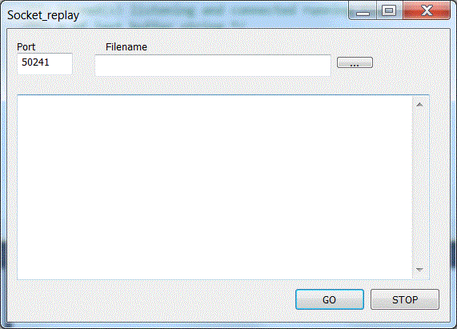
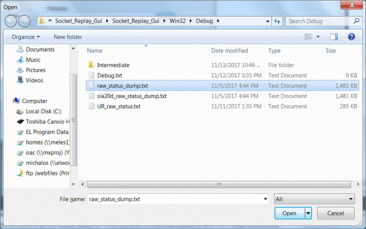
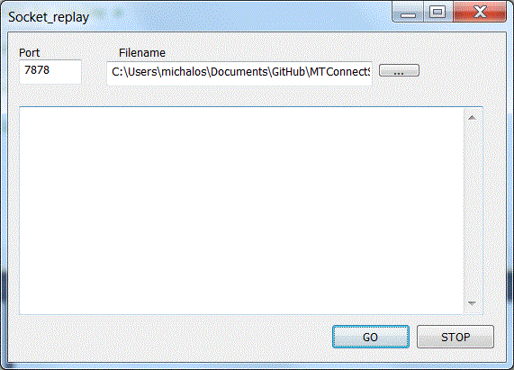
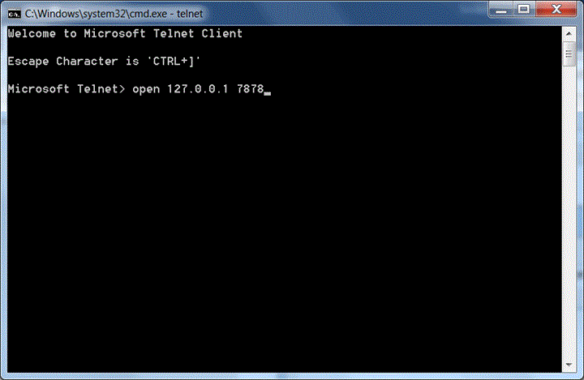
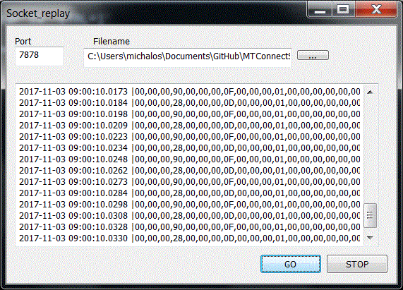
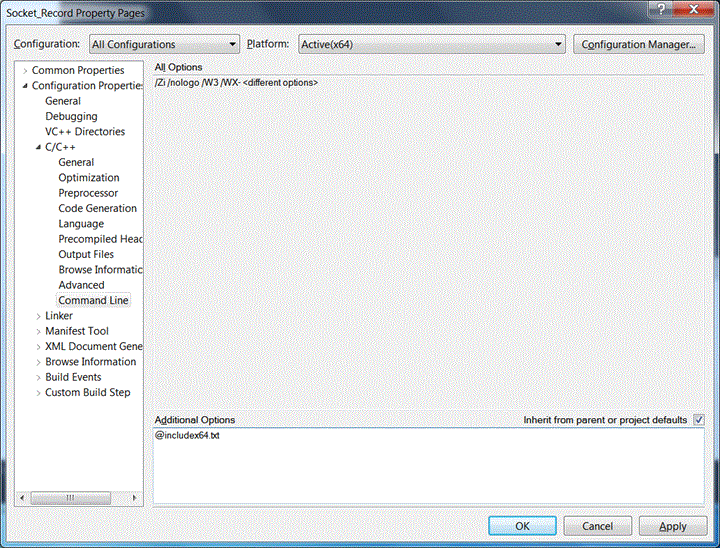


# Socket Stream Replay Documentation
 
----

Tuesday, November 14, 2017
This document describes the replay of timestamped socket capture on a given socket using a capture filename. It is helpful in testing status socket streams. Status socket streams will be defined as TCP/IP streams that cyclically emit a stream as one or more packets of status information. This package can play back a recorded status stream so the programmer does not need the actual device to test against.  For example, a real status device may emit a stream on device 30002 with an IP associated with the controller. After recording the stream, it can be played back on the current machine at a given port. Typically, one would choose the IP/port pair 127.0.0.1 and 3002 to match the actual device port, but it is not mandatory.

Contents

# Table of Contents

2. [Quick Use](#Quick-Use)
3. [Capture Format](#Capture Format)
	3.1. [Configuring the Source Code for Compilation](#Configuring the Source Code for Compilation)
	3.2. [C++ Header Configuration](#C++ Header Configuration)
4. [Link Configuration](#Link Configuration)
5. [Logging](#Logging)
6. [Ini File Software](#Ini File Software)
	6.1. [DISCLAIMER](#DISCLAIMER)
	6.2. [Use of NIST Information](#Use of NIST Information)
7. [Software Disclaimer](#Software Disclaimer)
8. [Socket_Replay_Dlg Class Reference](#Socket_Replay_Dlg Class Reference)
9. [RCS::CMessageQueue< T > Class Template Reference](#RCS::CMessageQueue< T > Class Template Reference)
10. [SocketBackEnd Class Reference](#SocketBackEnd Class Reference)** 

# Quick Use 

The application is a win32 windows GUI.  It uses the most basic of win32 windows technology and attempts to encapsulate all the windows specific event interaction inside a replay dialog class.

One fills in the port number (assuming the firewall lets the application through), and then selects a stream log file (starting by searching in the execution folder) by pressing the "…" button.   It may take a while, but a file picing dialogue will pop up and the user need to pick a compliant log stream file:

Here three files are compliant: raw_status_dump.tx, sia20d_raw_status-dump.txt and UR_raw_status.txt.
After a streaming log file has been selected, the user can start the replay of the streaming by pressing the GO . If there are no connections, the status screen will be blank:

If a client is listening the output will be echoed in the large status text field. If one wants to stop streaming one can press the STOP button.  To illustrate that streaming occurs, open a DOS command prompt and run telnet. If one issues the command "open 127.0.0.1 7878" matching the listening port of the replay GUI, then a stream of timed log raw entries will be replaid.

The raw binary will look like weird characters in the telnet session, however, the gui uses the Ascii hex string to output, not the raw binary.
To exit the application, press the [x] button in the upper right hand corner of the window.
#  Capture Format
It is assumed that one wants to capture raw binary socket stream data. There is no concept of a framing sequence or other stream end of packet marking.  Entire packets are captured and timestamped and saved to log file in a simple format. It is assumed that capture is not too arduous, as the recording of the socket stream is read and written to file.  This a rather slow implementation, as the socket could be read, packets stored into memory, and then when in-memory buffer is full the entire buffer is written to file. 
The capture file format is timestamp|hex transliteration of each character …. \n i.e.,

	Timestamp | xx, xx, . . . xx, \n
Thus, each packet is first timestamped and then translated into a series of hex characters matching its binary equivalent character in the stream, and a line feed is appended at the end of the packet.  The socket capture is thus a timestamp series of packet captures especially useful for raw binary communication.  Below illustrates two timestamped lines of a socket capture.

	2017-11-03 09:00:09.0471 |00,00,00,90,00,00,00,0F,00,00,00,01,00,00,00,00,00,00,00,00,00,00,00,02,00,00,00,00,3F,4B,11,AF,3E,C1,FE,4D,00,00,00,00,BF,F7,DA,1F,BA,56,FF,35,BF,52,0B,20,BF,65,F7,BA,00,00,00,00,00,00,00,00,00,00,00,00,00,00,00,00,00,00,00,00,00,00,00,00,00,00,00,00,00,00,00,00,00,00,00,00,00,00,00,00,00,00,00,00,00,00,00,00,00,00,00,00,00,00,00,00,00,00,00,00,00,00,00,00,00,00,00,00,00,00,00,00,00,00,00,00,00,00,00,00,00,00,00,00,00,00,00,00,00,00,00,00,
	2017-11-03 09:00:09.0482 |00,00,00,28,00,00,00,0D,00,00,00,01,00,00,00,00,00,00,00,00,00,00,00,01,00,00,00,00,00,00,00,00,00,00,00,00,00,00,00,02,00,00,00,00,
Replay means the timestamps are interpreted as the time difference between transmitting the packets across the given socket, assuming there are listeners.

# Configuring the Source Code for Compilation 
Configuring the source code for compilation and linking requires a two-part manual tweaking operation. This is due to the fact that the include and link libraries paths are hard coded.  This is not elegant, but sometimes it is easier to ascertain when things are wrong.
First, you must set up the include file so that all the include files can be found properly and second the link module must be modified so that the boost libraries can be found.
Add the preprocess definition: _WINDOWS
64 bits configuration: Add the preprocess definition: WIN64

##  C++ Header Configuration
All include file paths are stored in a file and then referenced in the command line configuration.
The include.txt uses the -I flag to add additional search folders for include files. For example:

	-I"D:\Program Files\NIST\src\wtl81\Include"
	-I"D:\Program Files\NIST\src\boost_1_54_0"
	-I.
Tells the MSVC compiler to search for wtl and boost include folders as well as the current folder (i.e. "."). This is not very elegant, except for the cases where you have third party libraries/DLLs that you do not want stored amid you source code. Then you can reference their include files using this technique, and link to the library definition by modifying LinkModule.cpp.

##  Link Configuration
To customize the source code there is a linking module in the project, named LinkingModule.cpp, that uses the "#pragma comment(lib. . ." MSVC construct to declare what libraries to link against. The software uses boost and thus needs to know where the boost libraries are located. Thus, the macros BOOSTLIBPATH32 and BOOSTLIBPATH64 were used to assist in defining the folder location of the boost libraries. Below, the macros are defined for the 64-bit machine:

	if 0
	#define BOOSTLIBPATH32(X) \
	    "D:\\Program Files\\NIST\\src\\boost_1_54_0\\stageX32\\lib\\"##X 
	#else
	#define BOOSTLIBPATH64(X) \
	    "C:\\Program Files\\NIST\\src\\boost_1_54_0\\vc10\\stagex64\\lib\\"##X
	#define BOOSTLIBPATH32(X) \
	    "C:\\Program Files\\NIST\\src\\boost_1_54_0\\vc10\\stagex32\\lib\\"##X
	#endif

One could of course enhance the macro differentiation. Then, depending on the build configuration (debug versus release, 64 bit versus 32 bit) different boost libraries are used. Below the preprocessor definition #if is used to differentiate the different architectures, which assume the preprocessor definitions  WIN64, _DEBUG, WIN32 are defined appropriately in the processor configuration settings in MSVC.

	#if defined( WIN64 ) && defined( _DEBUG )
	#pragma message("DEBUG x64")
	#pragma comment(lib, BOOSTLIBPATH64("libboost_system-vc100-mt-sgd-1_54.lib"))
	#pragma comment(lib, BOOSTLIBPATH64("libboost_thread-vc100-mt-sgd-1_54.lib"))
	#elif !defined( _DEBUG ) && defined( WIN64 )
	#pragma message("RELEASE x64")
	#pragma comment(lib, BOOSTLIBPATH64("libboost_thread-vc100-mt-s-1_54.lib"))
	#pragma comment(lib, BOOSTLIBPATH64("libboost_system-vc100-mt-s-1_54.lib"))
	
	#elif defined( _DEBUG ) && defined( WIN32 )
	#pragma message("DEBUG x32")
	#pragma comment(lib, BOOSTLIBPATH32("libboost_system-vc100-mt-sgd-1_54.lib"))
	#pragma comment(lib, BOOSTLIBPATH32("libboost_thread-vc100-mt-sgd-1_54.lib"))
	#elif !defined( _DEBUG ) && defined( WIN32 )
	#pragma message("RELEASE x32")
	#pragma comment(lib, BOOSTLIBPATH32("libboost_thread-vc100-mt-s-1_54.lib"))
	#pragma comment(lib, BOOSTLIBPATH32("libboost_system-vc100-mt-s-1_54.lib"))
	#endif

#  Logging 
There is limited logging capability within the Socket replay.  The logging facility is based on ROS Console open source code, which can be found at https://github.com/ros/console_bridge/blob/master/include/console_bridge/console.h. ROS provides interesting C++ Logging filtering macros (once, periodically, etc.) here: https://github.com/ros/ros_comm/blob/4383f8fad9550836137077ed1a7120e5d3e745de/tools/rosconsole/include/ros/console.h Although  the logging facility is very robust and can be extracted out of the ROS framework with a little effort, the code base was too extensive to justify the work. 
The logging is global in scope in that the all diagnostic log messages are output to the class GLogger. GLogger is defined as an instance of class CLogger. Within the instance, there are several flags which can be used to change the logging functionality. One flag is accessed by the method DebugConsole() , with 0 giving no "OuputDebugConsole" for windows, and 1 echoing the logging message to output. There is a level determined by the method DebugLevel() which determines the threshold of diagnostic activity, which is explained a bit later.  The flag Timestamping( ) determines whether a timestamp will be prepended to every diagnostic message. If Timestamping( )  is true,  timestamps will be appended. For example, the logStatus message with a timestamp is shown below:

	2017-10-24 09:23:57.0259 Start UR_ Agent
The   CLogger variable DebugFile() determines the filename in which log messages are appended.  By default the filename is debug.txt and the location of the file is in the execution application directory.  
Users of applications can indeed create different log file using CLogger and DebugFile(), however, one will be limited to the logging method: logmessage (const char *file, int line, LogLevel level, const char *fmt, ...) to log message. Plus, the macros described below only output to GLogger, which take advantage of the logmessage method.
The logging level [-1..5] determines the amount of logging that will be done. Each numeric value corresponds to a threshold where logging will be done.  0 corresponds to Fatal, 1 corresponds to Error, 2 corresponds to Warning, 3 corresponds to Inform, and 4 corresponds to Debug.
System logging threshold omit logging with a diagnostic level above the system level. For example a system logging level of 3 will omit debug message (logging level 5) 
 - logAbort(fmt, ...)  Something unrecoverable has happened. Application will terminate imeediately, and not gracefully. 
 - logFatal(fmt, ...)     Something catastrophic has happened, attempt to shut the application down.                                    
 - logStatus(fmt, ...)  Information that is provided regardless of logging level.
 - logError(fmt, ...)  Something serious (but recoverable) has gone wrong.
 - logWarn(fmt, ...) Information that the user may find alarming, and may affect the output of the application, but is part of the expected working of the system.
 - logInform(fmt, ...) Small amounts of information that may be useful to a user.
 - logDebug(fmt, ...)   Information that you never need to see if the system is working properly.

There is logging level of None but it is unclear if this is obeyed.
Below is an example of the use of the logDebug macro. It accepts a character string as format, and a variable length  of arguments follow determined by the format statement. It uses stdargs to handle the variable arguments. 

	#include "NIST/Logger.h"
	. . .
			logDebug("\tAdapter %s Server Rate=%d\n", mDevice.c_str(), mServerRate);
	. . .

There is a C++ macro LOG_ONCE(X) to limit the logging output to only once. For example, the previous code can be output once by the following code modification:

	#include "NIST/Logger.h"
	. . .
			LOG_ONCE (
	                         logDebug("\tAdapter %s Server Rate=%d\n", mDevice.c_str(), mServerRate);
	                       )
	. . .
There is also a  LOG_THROTTLE(secs, X) based on the ROS filtering strategies, this macro will limit the output to a log on a periodic basis, with the rate determined in seconds. Thus, in the example below, the diagnostic message output will be throttled to once per minute.  If the time between logging outputs is greater than 60 seconds, then this log message will be output, and the logging timer will be reset.

	#include "NIST/Logger.h"
	. . .
			LOG_ THROTTLE (60,
	                         logDebug("\tAdapter %s Server Rate=%d\n", mDevice.c_str(), mServerRate);
	                       )
	. . .

In order to access the logging facility, at the beginning of the program a small preamble of code is necessary to setup and configure the logger. Below is a minimal example:

			GLogger.Open(File.ExeDirectory() + "debug.txt");
			GLogger.DebugLevel()=5;
			GLogger.Timestamping()=true;

In this case, the output file name is found in the exe folder and named debug.txt. The default logging level is 5, although it was overridden  later by a config file value. Likewise timestamping is enabled. Note, the use of method access to modify the flags (ie.e., ()). This is due to the fact that all these accessors pass a reference to the actual logger flag. Historically, this was done because it is easier to override a method than a variable in C++.
#  Ini File Software
The Socket replay relies on some in-house INI configuration file management that is not typical of normal MTConnect installations, which rely on YAML.  As an aside, if MTConnect had relied on JSON to provide configuration details, boost has a nice library. However, JSON is a compliant with YAML but not vice versa.
The INI file format is an informal standard for configuration based historically on the Microsoft. INI files are simple text files with a basic structure composed of sections, key/properties/tags, and values.
The basic element contained in an INI file is the key or property. Every key has a name and a value, delimited by an equals sign (=). The name appears to the left of the equals sign.

	name=value
For the Socket replay configuration, keys are be grouped into named sections. The section name appears on a line by itself, in square brackets ([ and ]). All keys after the section declaration are associated with that section. There is no explicit "end of section" delimiter; sections end at the next section declaration, or the end of the file. Sections may not be nested. The term key and property and tag are used interchangeably and describe the same INI file element.

	[section]
	key=value
	tag=value
The ini file software is managed by the class Config, and uses a simplist variant class (StringVariant) to manage the different configuration types and conversion. Note, for this implementation the ability to determine wheter string case in keys and section names is important was added. For this implementation, Config assumes section and key names are CASE INSENSITIVE.  This was found to be useful as Microsoft ini file functions  (e.g., WritePrivateProfileString) are case insensitive as well. 

The software operation of the ini file management is done in the agent on a global level and in each adapter on a local device level. They both use the same Config.ini file for reading configuration data.  The Config.ini filename is held in the variable Globals.mInifile and is tested for existence. A fatal error occurs if the file is not found, and the Socket replay logs an fatal message and terminates. If the file exists, each important key is read from a section. For the agent, this section name is "GLOBALS" and for each adapter, it is the name of the robot device (e.g., [marvin]). Then each key is read into the corresponding global or device variable. 

	void AgentConfigurationEx::initialize (int aArgc, const char *aArgv[])
	{
	    std::string cfgfile = Globals.mInifile;
	
	    if (File.Exists(cfgfile.c_str( ))
	    {
	        mConfig.load(cfgfile);
	
	        Globals.mServerName
	            = mConfig.GetSymbolValue<std::string>("GLOBALS.ServiceName", Globals.mServerName);
	         MTConnectService::setName(Globals.mServerName);
	. . .
	
	        mDevices = mConfig.GetTokens("GLOBALS.MTConnectDevice", ",");
	
First, the ini file must be read:

	        mConfig.load(cfgfile);
Once loaded, any key or section can be parsed. Each key/value pair is read, and then the method GetSymbolValue is a template method which uses the template type in order to convert the underlying Config variant type into the given type (in this example the template typename is std::string). Importantly for MTConnect, one can name the Socket replay service and then store this name into the MTConnect Institute core agent:

	        Globals.mServerName
	            = mConfig.GetSymbolValue<std::string>("GLOBALS.ServiceName", Globals.mServerName);
	         MTConnectService::setName(Globals.mServerName);
The Config file also has the method to parse a token list (e.g., comma separated values) and return a standard vector of string. Thus GetTokens reads the section "[GLOBALS]" and the key "MTConnectDevice" first as a key/value pair, and then parses the value using the "," comma separator. This mDevices  variable ultimately contains the list of devices for which an adapter must be created.

	        mDevices = mConfig.GetTokens("GLOBALS.MTConnectDevice", ",");
The Config class is simplistic way of dealing with configuration data, but only requires a modest amount of code, and most every programmer is familiar with ini files.
#  DISCLAIMER
##  Use of NIST Information
This document is provided as a public service by the National Institute of Standards and Technology (NIST). With the exception of material marked as copyrighted, information presented on these pages is considered public information and may be distributed or copied. Use of appropriate byline/photo/image credits is requested.
##  Software Disclaimer
NIST-developed software is provided by NIST as a public service. You may use, copy and distribute copies of the software in any medium, provided that you keep intact this entire notice. You may improve, modify and create derivative works of the software or any portion of the software, and you may copy and distribute such modifications or works. Modified works should carry a notice stating that you changed the software and should note the date and nature of any such change. Please explicitly acknowledge the National Institute of Standards and Technology as the source of the software.
NIST-developed software is expressly provided "AS IS." NIST MAKES NO WARRANTY OF ANY KIND, EXPRESS, IMPLIED, IN FACT OR ARISING BY OPERATION OF LAW, INCLUDING, WITHOUT LIMITATION, THE IMPLIED WARRANTY OF MERCHANTABILITY, FITNESS FOR A PARTICULAR PURPOSE, NON-INFRINGEMENT AND DATA ACCURACY. NIST NEITHER REPRESENTS NOR WARRANTS THAT THE OPERATION OF THE SOFTWARE WILL BE UNINTERRUPTED OR ERROR-FREE, OR THAT ANY DEFECTS WILL BE CORRECTED. NIST DOES NOT WARRANT OR MAKE ANY REPRESENTATIONS REGARDING THE USE OF THE SOFTWARE OR THE RESULTS THEREOF, INCLUDING BUT NOT LIMITED TO THE CORRECTNESS, ACCURACY, RELIABILITY, OR USEFULNESS OF THE SOFTWARE.
You are solely responsible for determining the appropriateness of using and distributing the software and you assume all risks associated with its use, including but not limited to the risks and costs of program errors, compliance with applicable laws, damage to or loss of data, programs or equipment, and the unavailability or interruption of operation. This software is not intended to be used in any situation where a failure could cause risk of injury or damage to property. The software developed by NIST employees is not subject to copyright protection within the United States.

#  Socket_Replay_Dlg Class Reference
The Socket**_Replay_Dlg** class is a simple win32 class that does not need ATL/WTL or MFC to present a dialog for the user to replay a saved stream file. It only works on win32 PCs! The user inputs a socket port number and a full path filename using the win32 file control dialog, and when you click the Start button, the file will be replaid, once there is at least one connection to localhost and port number. If the use wishes to stop the replay, the STOP button is clicked. To exit the application the close button on the top right window corner (i.e., [x]) is clicked. .
#include <Socket**_Replay_Dlg.** >
<TABLE>
<TR>
<TD>Public Member Functions </TD>
</TR>
<TR>
<TD>  </TD>
<TD>Socket_Replay_Dlg (void) </TD>
</TR>
<TR>
<TD>  </TD>
<TD>Socket_Replay_Dlg constructor for replay dialog handler. . </TD>
</TR>
<TR>
<TD>  </TD>
</TR>
<TR>
<TD>HWND  </TD>
<TD>Create (HINSTANCE hInst, int nCmdShow) </TD>
</TR>
<TR>
<TD>  </TD>
<TD>Create creates the replay dialog window using resource id. . </TD>
</TR>
<TR>
<TD>  </TD>
</TR>
<TR>
<TD>char *  </TD>
<TD>SelectFile (HWND hwnd, const char *folder) </TD>
</TR>
<TR>
<TD>  </TD>
<TD>SelectFile uses win32 control to select exiting file. . </TD>
</TR>
<TR>
<TD>  </TD>
</TR>
<TR>
<TD>void  </TD>
<TD>halt () </TD>
</TR>
<TR>
<TD>  </TD>
<TD>halt stops the streaming loop thread  </TD>
</TR>
<TR>
<TD>  </TD>
</TR>
<TR>
<TD>void  </TD>
<TD>fatal_msg (std::string) </TD>
</TR>
<TR>
<TD>  </TD>
<TD>fatal_msg logs a message to the text edit window. Clears screen first.  </TD>
</TR>
<TR>
<TD>  </TD>
</TR>
<TR>
<TD>void  </TD>
<TD>screen_msg (std::string) </TD>
</TR>
<TR>
<TD>  </TD>
<TD>screen_msg logs a message to the text edit window.  </TD>
</TR>
<TR>
<TD>  </TD>
</TR>
</TABLE>
Static Public Member Functions

<TABLE>
<TR>
<TD>Static Public Member Functions </TD>
</TR>
<TR>
<TD>static BOOL  </TD>
<TD>CenterWindow (HWND hwndWindow) </TD>
</TR>
<TR>
<TD>  </TD>
<TD>CenterWindow centers window on screen, from MS and web. . </TD>
</TR>
<TR>
<TD>  </TD>
</TR>
<TR>
<TD>static INT_PTR CALLBACK  </TD>
<TD>DialogProc (HWND hDlg, UINT uMsg, WPARAM wParam, LPARAM lParam) </TD>
</TR>
<TR>
<TD>  </TD>
<TD>DialogProc. . </TD>
</TR>
<TR>
<TD>  </TD>
</TR>
</TABLE>
Public Attributes

<TABLE>
<TR>
<TD>Public Attributes </TD>
</TR>
<TR>
<TD>bool  </TD>
<TD>bOptionWait </TD>
</TR>
<TR>
<TD>  </TD>
</TR>
<TR>
<TD>SocketBackEnd  </TD>
<TD>mBackend </TD>
</TR>
<TR>
<TD>  </TD>
</TR>
<TR>
<TD>SocketParser  </TD>
<TD>mParser </TD>
</TR>
<TR>
<TD>  </TD>
</TR>
</TABLE>
Protected Member Functions

<TABLE>
<TR>
<TD>Protected Member Functions </TD>
</TR>
<TR>
<TD>void  </TD>
<TD>stream_loop () </TD>
</TR>
<TR>
<TD>  </TD>
<TD>stream_loop is thread that parses a playback file and outputs the next packet to a socket.  </TD>
</TR>
<TR>
<TD>  </TD>
</TR>
</TABLE>
Static Protected Member Functions

<TABLE>
<TR>
<TD>Static Protected Member Functions </TD>
</TR>
<TR>
<TD>static Socket_Replay_Dlg *  </TD>
<TD>GetObjectFromWindow (HWND hWnd) </TD>
</TR>
<TR>
<TD>  </TD>
<TD>GetObjectFromWindow returns a pointer the window (stored as the WindowLong) useful for threading to get the class instance associated with a handle to window. From https://www.codeproject.com/articles/2556/a-simple-win-window-wrapper-class. . </TD>
</TR>
<TR>
<TD>  </TD>
</TR>
</TABLE>
Protected Attributes

<TABLE>
<TR>
<TD>Protected Attributes </TD>
</TR>
<TR>
<TD>RCS::CMessageQueue< std::string >  </TD>
<TD>buffer_queue </TD>
</TR>
<TR>
<TD>  </TD>
</TR>
<TR>
<TD>bool  </TD>
<TD>mStreamFlag </TD>
</TR>
<TR>
<TD>  </TD>
</TR>
<TR>
<TD>int  </TD>
<TD>mCountdown </TD>
</TR>
<TR>
<TD>  </TD>
</TR>
<TR>
<TD>double  </TD>
<TD>dTimeMultipler </TD>
</TR>
<TR>
<TD>  </TD>
</TR>
<TR>
<TD>std::string  </TD>
<TD>mFilename </TD>
</TR>
<TR>
<TD>  </TD>
</TR>
<TR>
<TD>char  </TD>
<TD>szFile [260] </TD>
</TR>
<TR>
<TD>  </TD>
</TR>
<TR>
<TD>HWND  </TD>
<TD>hDlg </TD>
</TR>
<TR>
<TD>  </TD>
</TR>
<TR>
<TD>HWND  </TD>
<TD>port_hwnd </TD>
</TR>
<TR>
<TD>  </TD>
</TR>
<TR>
<TD>HWND  </TD>
<TD>edit_hwnd </TD>
</TR>
<TR>
<TD>  </TD>
</TR>
</TABLE>
****
#  <a name="RCS::CMessageQueue< T > Class Template Reference
"></a>RCS::CMessageQueue< T > Class Template Reference
The CMessageQueue offers a mutexed front to a STL/std deque. The queue is a LIFO data structure. Useful for safely sharing data between multiple threads. More...
#include <RCSMsgQueue**.** >
<TABLE>
<TR>
<TD>Public Types </TD>
</TR>
<TR>
<TD>typedef std::deque< T >  </TD>
<TD>xml_message_queue </TD>
</TR>
<TR>
<TD>  </TD>
</TR>
<TR>
<TD>typedef std::deque< T >::iterator  </TD>
<TD>xml_message_queue_iterator </TD>
</TR>
<TR>
<TD>  </TD>
</TR>
</TABLE>
Public Member Functions

<TABLE>
<TR>
<TD>Public Member Functions </TD>
</TR>
<TR>
<TD>void  </TD>
<TD>ClearMsgQueue () </TD>
</TR>
<TR>
<TD>  </TD>
<TD>ClearMsgQueue clears all contents in message queue. T.  </TD>
</TR>
<TR>
<TD>  </TD>
</TR>
<TR>
<TD>size_t  </TD>
<TD>SizeMsgQueue () </TD>
</TR>
<TR>
<TD>  </TD>
<TD>SizeMsgQueue returns number of items in message queue.  </TD>
</TR>
<TR>
<TD>  </TD>
</TR>
<TR>
<TD>T  </TD>
<TD>PopFrontMsgQueue () </TD>
</TR>
<TR>
<TD>  </TD>
<TD>PopFrontMsgQueue mutex pop of front item of message queue. More... </TD>
</TR>
<TR>
<TD>  </TD>
</TR>
<TR>
<TD>T  </TD>
<TD>PeekFrontMsgQueue () </TD>
</TR>
<TR>
<TD>  </TD>
<TD>PeekFrontMsgQueue mutex peeks at front item of message queue. More... </TD>
</TR>
<TR>
<TD>  </TD>
</TR>
<TR>
<TD>T  </TD>
<TD>BackMsgQueue () </TD>
</TR>
<TR>
<TD>  </TD>
<TD>BackMsgQueue mutex retrieves back item of message queue. Does not pop queue. More... </TD>
</TR>
<TR>
<TD>  </TD>
</TR>
<TR>
<TD>void  </TD>
<TD>AddMsgQueue (T t) </TD>
</TR>
<TR>
<TD>  </TD>
<TD>AddMsgQueue mutex push to back an item onto message queue. More... </TD>
</TR>
<TR>
<TD>  </TD>
</TR>
<TR>
<TD>void  </TD>
<TD>AddBackMsgQueue (T t) </TD>
</TR>
<TR>
<TD>  </TD>
<TD>AddMsgQueue mutex push to back an item onto message queue. More... </TD>
</TR>
<TR>
<TD>  </TD>
</TR>
<TR>
<TD>void  </TD>
<TD>AddFrontMsgQueue (T t) </TD>
</TR>
<TR>
<TD>  </TD>
<TD>AddMsgQueue mutex push to front an item onto message queue. More... </TD>
</TR>
<TR>
<TD>  </TD>
</TR>
<TR>
<TD>void  </TD>
<TD>InsertFrontMsgQueue (T t) </TD>
</TR>
<TR>
<TD>  </TD>
<TD>InsertFrontMsgQueue mutex push to front an item onto message queue. More... </TD>
</TR>
</TABLE>

#  SocketBackEnd Class Reference
Background thread to accept connections to read shdr data. More...
#include <SocketBackEnd**.** >
<TABLE>
<TR>
<TD>Public Member Functions </TD>
</TR>
<TR>
<TD>void  </TD>
<TD>HandleAsyncAccept (const boost::system::error_code &error) </TD>
</TR>
<TR>
<TD>  </TD>
<TD>HandleAsyncAccept is asio callback to accept replay connection and start thread to service connection. More... </TD>
</TR>
<TR>
<TD>  </TD>
</TR>
<TR>
<TD>void  </TD>
<TD>StartAsyncAccept () </TD>
</TR>
<TR>
<TD>  </TD>
<TD>StartAsyncAccept starts listening for aychronous connection.  </TD>
</TR>
<TR>
<TD>  </TD>
</TR>
<TR>
<TD>void  </TD>
<TD>StopAsyncAccept () </TD>
</TR>
<TR>
<TD>  </TD>
<TD>StopAsyncAccept stops listening for aychronous connection.  </TD>
</TR>
<TR>
<TD>  </TD>
</TR>
<TR>
<TD>void  </TD>
<TD>Init (std::string domain, LONG portnumber) </TD>
</TR>
<TR>
<TD>  </TD>
<TD>Init sets up asio for asynchronous connection and communication. More... </TD>
</TR>
<TR>
<TD>  </TD>
</TR>
<TR>
<TD>void  </TD>
<TD>StoreSocketString (raw_message_t str) </TD>
</TR>
<TR>
<TD>  </TD>
<TD>StoreSocketString raw array to send to all clients. More... </TD>
</TR>
<TR>
<TD>  </TD>
</TR>
<TR>
<TD>void  </TD>
<TD>Quit (void) </TD>
</TR>
<TR>
<TD>  </TD>
<TD>Quit stop all the communication.  </TD>
</TR>
<TR>
<TD>  </TD>
</TR>
<TR>
<TD>void  </TD>
<TD>Reset (void) </TD>
</TR>
<TR>
<TD>  </TD>
<TD>Reset changes flag to not inited.  </TD>
</TR>
<TR>
<TD>  </TD>
</TR>
<TR>
<TD>std::string &  </TD>
<TD>Ip () </TD>
</TR>
<TR>
<TD>  </TD>
<TD>Ip return TCP/IP host that communication occurs on. More... </TD>
</TR>
<TR>
<TD>  </TD>
</TR>
<TR>
<TD>UINT &  </TD>
<TD>Port () </TD>
</TR>
<TR>
<TD>  </TD>
<TD>Port return TCP/IP port number that communication occurs on. More... </TD>
</TR>
<TR>
<TD>  </TD>
</TR>
<TR>
<TD>int &  </TD>
<TD>Count () </TD>
</TR>
<TR>
<TD>  </TD>
<TD>Count number of communication connections listening to replay. More... </TD>
</TR>
<TR>
<TD>  </TD>
</TR>
<TR>
<TD>void  </TD>
<TD>session (socket_ptr sock) </TD>
</TR>
<TR>
<TD>  </TD>
<TD>session is a separate communication thread to each listening client. This thread sends raw messages to the listener. More... </TD>
</TR>
<TR>
<TD>  </TD>
</TR>
<TR>
<TD>void  </TD>
<TD>server (boost::asio::io_service &io_service, short port) </TD>
</TR>
<TR>
<TD>  </TD>
<TD>server thread that listens for connection. More... </TD>
</TR>
</TABLE>

#  SocketParser Class Reference
Class provides a simple file replay parser. More...
#include <SocketParser**.** >
<TABLE>
<TR>
<TD>Public Member Functions </TD>
</TR>
<TR>
<TD>  </TD>
<TD>SocketParser (SocketBackEnd &backEnd) </TD>
</TR>
<TR>
<TD>  </TD>
<TD>Constructor that turn repeat of file off, set first time and captures current time. Todo: the clock resolution is only second level, and MTConnect easily has millisecond Socket updates.  </TD>
</TR>
<TR>
<TD>  </TD>
</TR>
<TR>
<TD>void  </TD>
<TD>Reset (void) </TD>
</TR>
<TR>
<TD>  </TD>
<TD>Reset is done before the beginning of a file. Either first or each repeated time.  </TD>
</TR>
<TR>
<TD>  </TD>
</TR>
<TR>
<TD>void  </TD>
<TD>split (std::string str, raw_message_t &msg) </TD>
</TR>
<TR>
<TD>  </TD>
<TD>split inputs a comma separated 2 digit hex string, and returns a raw binary message. More... </TD>
</TR>
<TR>
<TD>  </TD>
</TR>
<TR>
<TD>double  </TD>
<TD>ProcessStream () </TD>
</TR>
<TR>
<TD>  </TD>
<TD>Processes a line from the given Socket file. Extracts timestamp (first field until | delimiter) and computes how long from last timestamp. If the repeat flag is set, will repeat Socket file from start, resetting all timestamp value to new current time. More... </TD>
</TR>
<TR>
<TD>  </TD>
</TR>
<TR>
<TD>void  </TD>
<TD>Init (std::string filename) </TD>
</TR>
<TR>
<TD>  </TD>
<TD>Attempts to open Socket file for echoing, throw execption if unable to open file. More... </TD>
</TR>
<TR>
<TD>  </TD>
</TR>
<TR>
<TD>bool &  </TD>
<TD>Repeat () </TD>
</TR>
<TR>
<TD>  </TD>
<TD>Flag to determine replaying of file. True replay. False one-time play. More... </TD>
</TR>
<TR>
<TD>  </TD>
</TR>
<TR>
<TD>std::string &  </TD>
<TD>GetLatestBuffer () </TD>
</TR>
<TR>
<TD>  </TD>
<TD>Get latest hex buffer from file.  </TD>
</TR>
<TR>
<TD>  </TD>
</TR>
<TR>
<TD>raw_message_t &  </TD>
<TD>GetLatestMsg () </TD>
</TR>
<TR>
<TD>  </TD>
<TD>Get latest raw binary message from file.  </TD>
</TR>
<TR>
<TD>  </TD>
</TR>
<TR>
<TD>std::string &  </TD>
<TD>GetLatestTimestamp () </TD>
</TR>
<TR>
<TD>  </TD>
<TD>Get latest timestamp read from file. More... </TD>
</TR>
<TR>
<TD>  </TD>
</TR>
<TR>
<TD>size_t &  </TD>
<TD>LineNumber () </TD>
</TR>
<TR>
<TD>  </TD>
<TD>Get latest Line Number.  </TD>
</TR>
<TR>
<TD>  </TD>
</TR>
</TABLE>
Protected Attributes

<TABLE>
<TR>
<TD>Protected Attributes </TD>
</TR>
<TR>
<TD>boost::posix_time::ptime  </TD>
<TD>_realtimetime </TD>
</TR>
<TR>
<TD>  </TD>
</TR>
<TR>
<TD>boost::posix_time::ptime  </TD>
<TD>_currenttime </TD>
</TR>
<TR>
<TD>  </TD>
</TR>
<TR>
<TD>boost::posix_time::ptime  </TD>
<TD>_lasttime </TD>
</TR>
<TR>
<TD>  </TD>
</TR>
<TR>
<TD>boost::posix_time::time_duration  </TD>
<TD>_duration </TD>
</TR>
<TR>
<TD>  </TD>
</TR>
<TR>
<TD>std::string  </TD>
<TD>_timestamp </TD>
</TR>
<TR>
<TD>  </TD>
</TR>
<TR>
<TD>std::string  </TD>
<TD>_buffer </TD>
</TR>
<TR>
<TD>  </TD>
</TR>
<TR>
<TD>raw_message_t  </TD>
<TD>_msg </TD>
</TR>
<TR>
<TD>  </TD>
</TR>
<TR>
<TD>std::string  </TD>
<TD>_binaryfilename </TD>
</TR>
<TR>
<TD>  </TD>
</TR>
<TR>
<TD>bool  </TD>
<TD>_bRepeat </TD>
</TR>
<TR>
<TD>  </TD>
</TR>
<TR>
<TD>bool  </TD>
<TD>_bFirstTime </TD>
</TR>
<TR>
<TD>  </TD>
</TR>
<TR>
<TD>std::ifstream  </TD>
<TD>in </TD>
</TR>
<TR>
<TD>  </TD>
</TR>
<TR>
<TD>size_t  </TD>
<TD>_linenum </TD>
</TR>
<TR>
<TD>  </TD>
</TR>
<TR>
<TD>SocketBackEnd &  </TD>
<TD>_backEnd </TD>
</TR>
</TABLE>

